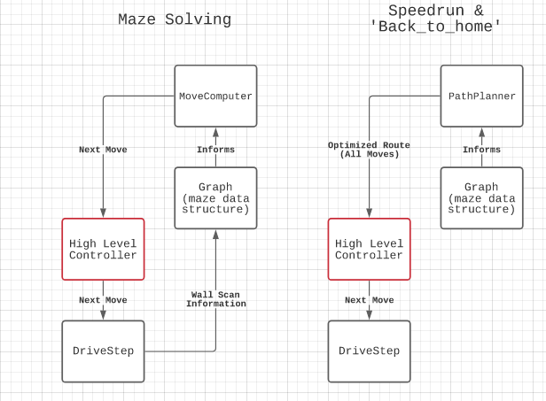
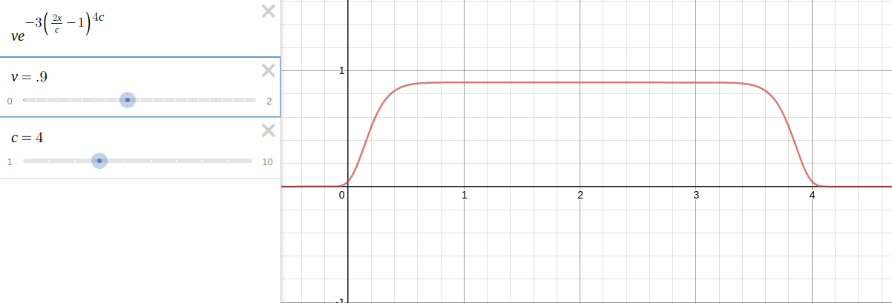

# Welcome to our comprobo final!

## What we did!
The goal of this project was to design and program a robot that could complete the Micromouse competition. Our custom differential drive bot autonomously navigates and solves a 16x16 maze, finding its way to the center on the first run. It then returns to its starting point by generating a path from its understanding of the maze. And lastly, it pathplans an optimized route for a final thrilling speedrun to the center.

The project involved graph theory & recursive algorithm design, high speed robot motion control, discrete SLAM with LIDAR & odometry (so not really slam, lol), and pathplanning! `Great Success!`


[](https://www.youtube.com/watch?v=Khu0GxKtttg )
*Speedrun!*

[](https://www.youtube.com/watch?v=e3KHShxfUm0 )
*Full Challenge Completion*


## A sneak peek at some interesting challenges we faced
- The maze has loops! What happens when your bot is looking for the center but after exploring ends up back in the same place it was 20 steps ago?
- Custom robot models in ROS grant you immense control over their sensor output, but you have to pay close attention.
- Gazebo simulation issues (lidar clipping through walls, differential drive)

## Project Motivations
The micromouse challenge was a great project in that it was a solid combination of 3D modeling / design, robot localization + graph theory, pathfinding, and robot motor control & dynamics. It also provided us with a nice, clear end goal from the start. 

## The high level robot controller, explained
The high level control is the easiest way to understand our system from an abstracted point of view.
The `Controller` class handles all top level arbitration, and calls all of our lower level API's to do any computation with routing, pathplanning, or interface with ROS via pubsub for robot control.  


*System block diagram*

As seen in the system diagram above, there are 2 main modes of operation for our controller - **Maze Solving** and **Speed_run**.

### Maze Solving
Here the robot has *no* previous understanding of the maze, other than knowledge of the target / center's location.  
It uses the `DriveStep` API to interface with ROS, which abstracts away reading and interpreting odometery and LIDAR scan data, and discrete robot control in unit steps within the maze. It passes the data returned from `DriveStep` (namely the presence or absence of the N E S W wall directions at the bot's current position) into the graph. The Graph is used to store the bot's understanding of the maze.

The `MoveComputer` takes the current graph and computes the next best move for the bot - it can robustly handle dead-ends, loops, and not knowing anything about the maze at all! Finally, the `MoveComputer` passes the next move to the `Controller`, and the entire process is repeated until the center is reached.

### Speed_run
Here, the robot already has maze data stored in the graph (this state of controller will only ever be entered after `Maze Solving` is completed). `Controller` uses `PathPlanner` to optimize a route to either the center or back home. Optimized routes are stored as a list of 'end nodes' for the bot to reach. The `Controller` then walks through all the optimized route and calls the `speed_run` function within DriveStep for every step.   

## Lower level API, in detail

### DriveStep (linreg, sigmoidal control, compute_keypoints)
We needed our maze navigation class to be as robust and independent as possible so it could easily work in parallel with a variety of higher level algorithms. The goal of DriveStep was to handle all of the robot's *local* positioning and control, including keeping account of the bot's orientation, ensuring its position was centered within every *unit* in the maze, and reading + interpreting environment sensor data.

Using 100Hz LIDAR scan data, we would check for walls nearby and calculate our bot's skew angle (either to the front, left, right or back wall). The `skew` variable held our angular skew, linear skew, and distance to the closest wall, and was computed using linear regression. Upon finding the closest wall, a matrix of polar coordinates was created from the LIDAR scan points. After re-centering the angles to spread around zero degrees, the bot creates a regression line who's slope defined its angular skew against that wall. Centering the angles before the linear regression allowed us to use angle skew as an objective measure of our error regardless of the bot's global oreintation (N E S W).

Once we had the skew for a given scan, we fed it to either our turning or driving method to move the robot. To achieve the optimal speed for both turning and course correction, we employed sigmoidal functions to connect our current orientation with angular velocity. Reducing jerking improved our turning accuracy, especially for 180 degree turns.

To ensure accurate distance traveled calculations, we implemented an additional method to detect keypoints in the maze. These 'keypoints' were edges of the walls signifying either the entrance to a path or a corner. By checking the 45 and 315 degree LIDAR scans, were able to **recognize the end of a unit square** within the maze, without needing a wall directly in front of the bot. 

### MoveComputer & Graph
One of our major design decisions was to store the robot's current understanding of the maze as a graph. This data structure needed to be ... 
- Fast to add information to as the robot moves through the maze
- Fast to access information from
- Have a usable API for traversals and computations
- Has a high level of visibility or is easy to visualize for debugging

Read more about this design decision in **blog post 1**. Every position the robot can be in within the graph is a node, and if the robot can move between two positions in the maze (there isn't a wall between those two discrete positions), the two nodes are connected. As the robot moves through the maze, it adds positions its visited as nodes to the graph.

The `MoveComputer` processes the graph and the robot's current position, and computes a next best move. It evaluates each direction the robot can go (or node connected to the current one) by computing a confidence. The confidence for a direction is based off
- the distance to the nearest *unknown*, or a connected node that hasn't yet been visited
- the distance from that unknown to the center.

We perform a depth-limited recursive depth-first search for every direction in the graph to find the nearest unknown in that direction. We depth limit our DFS to prevent getting caught in loops (which is commonplace in this maze)!

### PathPlanner (our custom implementation of A*)
The `PathPlanner` conssits of 2 components
- The `A*` algorithm implemented in python to interface with our graph and compute an optimized route between two unique nodes.
- A route optimization function `consolidate_path` that turns a list of nodes into a list of 'end nodes', which helps our `speedrun` function understand how long its next straightway stretch.     

Our implementation of A Star uses the F, G, and H heuristics, walking through and adding to a cost-sorted priority queue until it empties the queue or finds the target node. We use Euclidean distance as our heuristic and of course, children are limited by connected nodes (portions of the maze the bot can traverse) and nodes actually in the graph (portions of the maze the bot *did* traverse during Maze Solving).

### A special shout-out to `speed_run`!
The `speed_run` functionality of our `DriveStep` API takes the optimized route generated from the `PathPlanner`, and  uses a custom proportional control to set bot speed as it drives down long straightways in the route. 

Unlike in the pro micromouse challenge, our turns are still seperate from driving forwards (and funciton identically to our turns during Maze Solving), we no longer drive 'step by step' during straight portions of the robot path. The bot relies heaviliy on odometry to drive down long stretches and can consistently pick up to speeds up to 3x higher than it would when first solving the maze.   

The sigmoidal speed control for driving straight uses these equations. 




### A special shout-out to robot design!
The mousebot model for this project was uniquely designed for the gazebo maze. We designed a very simple two wheeled differential drive robot in SolidWorks to the size specifications given in the mousebot competition rules. Custom designing the robot meant that we could simplify our model to two wheels and a LIDAR. We imported the model using the URDF exporter, and were able to further critique the design for troubleshooting directly in the URDF file.

(this section could use a revisit)

## Challenges we faced
One of the drawbacks of making our own mousebot URDF model was that it was completely untested prior to our use. When manually setting the wheel's diameter and spacing for the differential drive plugin, the true values did not work well, and resulted in an inaccurate odometry sensing. Because of this fundamental inaccuracy of the robot's odometry, problmes popped up everywhere from turning to path centering to distance measurement. A significant amount of time was spent modifying the code before we realized the root cause of most of the problems.

A difficulty we encountered with the `MoveComputer` occurred when the robot discovered a loop in the maze. When the bot visited the final node of a loop, our `compute_next_move` recursive method would exceed a maximum recursion depth. This was due to the function circling around the loop indefinitely, looking for the closest un-visited node. We solved this by placing a max_iterations depth limit on the function.

The confidence calculations of our `MoveComputer` also resulted in what we termed 'back and forth' looping, where the robot would get stuck going back and forth between 2 positions indefinitely while trying to solve the maze. We resolved this by adjusting our confidence calculations for each direciton for each node - however, there is no doubt that more testing within other mazes is required before we know we squished this bug for sure. 

## Reflection & future improvements
The first aspect of our mapping run that could use improvement is the discrete stepping and turning at each unit square. This is a significant factor in our final run time and removing this pause between movements, such as we did in the speed_run, would time-optimize the longest part of our run. 


The speed run could be further improved by combining the turning and driving function. Turning while continuing to drive forward would remove the need to stop entirely. This would both decrease run time and reduce error from jerking.


Looking at the path planning, a future improvement would be to change how we define the fastest path. Rather than necassarily optimizing for the shortest overall path from point A to point B, we could alter our A star algorithm to find paths with more long straightways, that would be faster in the speed run. 

Spending more time to fine tune our MoveComputer's confidence 

Outside of our algorithm, we would love to have the time to test our mousebot in a few different mazes. Our code likely has many parts that work for this maze alone. Testing other mazes is a necessity for robust move computation and pathplanning.

# --------
# Blog 1 - a ‘guided & curious but lazy’ maze-solving algorithm 

If I were to drop you inside a life-sized maze right now, what would you do? What would your strategy be? 

Would you start by picking a random direction, and chase it down until you hit a deadend? Would you then try to remember everywhere you've been, backtrack, and try the next possible route? 

How would your behavior change if you always knew your position and the destination in the maze, relative to the starting point? That would be the equivalent of always being able to see the destination over the walls of the maze.

We needed to think about how to represent the robot’s accumulated knowledge of the maze (all the previous positions it’s visited, and the scan data at each position), and how to build those into a data structure we can easily manipulate and compute with.  

We designed  a compute_next_move() function that simply takes in the robot's current understanding of the maze and returns a direction for the robot’s next best move. This algorithm is the key to how the robot solves the maze. 

Let start by going over how we represent the robot’s position within the maze, and its knowledge of the maze. We need a data structure that is - 
Fast to add information to as the robot moves through the maze
Fast to access information from 
Easy to interact with for traversals and computations
Easy to understand AKA has a high level of visibility or is easy to visualize for debugging

We should note about the maze that it’s made of evenly spaced units and is in the shape of a square. If the maze has a side length of n units, the maze will have a total of n x n discrete positions the robot can be in at any point in time. For any position the robot is in, it only needs to check in 4 directions (N E S W) in a global frame or (F B L R) in a local frame if there are walls, and record that information. 

The discrete nature of the maze prevents us from needing to write full SLAM for our bot, and allows us to represent the maze as a graph. It makes the most sense to represent each discrete position in the maze as a node, and if the robot can move between one position and another (AKA there are no walls in between the two positions), the two nodes are connected in the graph. 

Python doesn’t have a built-in graph class, so instead we create our own with an adjacency list for every node, with all nodes in the graph stored as keys in a dictionary. It looks something like this. Nodes are named by their positions in the maze, with (0,0) being the bottom left position in the maze. 

```
Graph = {
    (0,0): [(0,1)], 
    (0,1): [(0,2), (0,0)]
}
```
As the Mousebot moves through the maze, it adds a node for each position it has visited to the list. 

This data structure meets all our needs - dictionaries are python’s equivalent of hash tables, so they’re very fast to append to, and access adjacency lists from. The way we set up the graph, in  choosing to represent each visited position as a node with connections to surrounding traversable positions / nodes also allows for easy traversal & manipulation of the graph (which will come in handy in the future).   

In order for the Mousebot to compute its next move as it solves the maze, it needed to always recognize the correct direction to go, which we denoted as the guiding vector. This vector represents the difference between the Mousebot’s current position and the final destination within the maze. 

The guiding vector of course isn’t enough to direct the robot towards the center - we wanted to factor in a ‘curious nature’ to the robot - we wanted to ensure it would recognize and go towards  unknowns within the maze, in the hope of discovering a path to the center. And at the same time, we were also aware the robot was under a time crunch - so if it found multiple unknowns, as it usually would, it should pick the closest one.

In order to compute what we would call the d_to_unkown value, we used DFS within the graph - however, instead of looking for any particular node, we’d simply look for nodes that didn’t exist in the graph (that would indicate the Mousebot hadn’t visited that position / node). I.e. if a specific position had 3 possible routes the Mousebot could take, and one of them wasn’t in the graph (wasn’t a key in the dictionary), we would count that as an unknown. 
Ultimately the compute_next_move() looked something like this. If the robot was at position (4,7), it would compute a confidence score for each direction it could go at (4,7). 

[confidence code] 

The confidence would be based off the inverse of the d_to_unkown (to emphasize being closer to an unknown value as better), as well as the dot product between the direction the robot would move to get to that new position and the guiding vector to represent how closely those two were matched. The direction with the highest confidence is the next direction the robot will move!

And yes, it works, as you can see in the videos at the top of the page!

# --------
# Blog 2 - discretizing our position within the maze
How much LIDAR do you need to perfectly discretize your position within a maze? Is more information always better?

From a high-level controller’s point of view, moving between a set of distinct points is faster to compute and can make it easier to implement other path planning algorithms. In fact, many algorithms we have considered, A* for example, already assume that they are given a discretized map.

The foundation for our code had to build a highly robust driver that could confidently move the robot to a desired position. Despite our dependency on this function, we had to keep in mind its computational efficiency. Using all 360 degrees of the LIDAR to detect straight walls would have been simply unnecessary.

So how much information DO you need to figure out where you are? Our first approach was to use 4 LIDAR scans pointing forwards, backwards, left, and right. For a while, this approach seemed to have merit with some simplified trial runs. As long as we started in the middle of the path, facing the right direction, we could continue straight without bumping a wall. However this approach could not differentiate between angular and linear deviation from the correct path.

A better approach is to find your angle to the walls at as often as possible. We continued using the 4 points around the mousebot to check for walls but, if walls were found, used a separate function to calculate the distance and angle to that wall. In the direction that we knew a wall was, we widened that scan to a range spanning 30 degrees of LIDAR data. We calculated a regression line from these points, and used it as our wall reference for determining angular and linear skew simultaneously. As long as we had at least one wall, we knew where in an isle we were.

So is that our answer? Was a few ranges of LIDAR data from the front, left, right, and back of the robot sufficient for discretizing our map? Well, yes and no. This strategy formed the bare bones of our localization, ensuring that we could stay in the middle of an isle. But we needed to go further to make our driver class more reliable.

What if the robot needed to make a turn in the middle of a long hallway? We needed to be able to measure distance traveled. One approach, and the one we set out using, is to simply use encoder data as a measure of distance. However, in addition to having its own noise, the encoder could not account for small corrections and deviations from our desired path. Imagine resetting your odometer and driving from Boston to Seattle, a distance of about 2500 miles. What will your car’s odometer read when you reach Seattle? Because the path you took was not straight, your odometer would end up reading closer to 3000 miles traveled.

To avoid this, we searched for markers with the LIDAR to find intersections in the maze. For these key points, we looked for wall edges where another hallway connected. We expanded our usage of the LIDAR to include the 45 degree angles to the front right and front left of the robot. Because the map is composed of squares, we knew we were in the center of a unit square when we detected a change in these 45 degree scans.

Although we use ranges of scans in many cases instead of single LIDAR points, it can be roughly summarized that we have 6 distinct directions in which we collect LIDAR scans. 

Was this the right way? Well, it’s hard to say, but looking at other examples from the mousebot competition, it is clear that there are many ways to accomplish our task. Many of the micromouse robots use single point IR sensors, as few as 4, to navigate the maze. Needless to say, most of these robots do not use discretized maps, and rely more on storing low level information. The robots for this competition are optimized solely for speed, and fewer computational strains seem to outweigh the value of a more comprehensive algorithm.

Again, one of the benefits of a discretized map is that we would be able to run path planning algorithms with more ease than on a list of directions.

So how does the driver class connect to the rest of our code? We call our driver in a separate control class that pulls from other classes for choosing directions and storing map data. The class is called with two simple values. (1) One, the coordinates of the next position to travel to in the map frame. (2) two, the speed at which we move. This leaves all controls subjective to the robot in the driver so the controller can focus on only the top level decision making.

We appreciate this approach. While not as fast as other micromouse robots, it is more sophisticated and, if given enough map information, has the potential to find a more efficient path than some robots from the competition.
